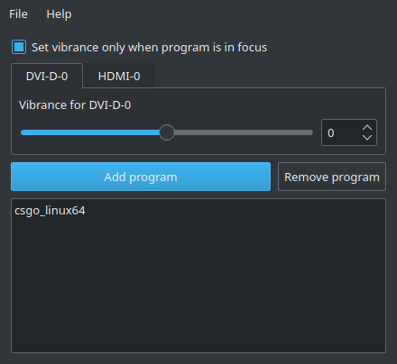
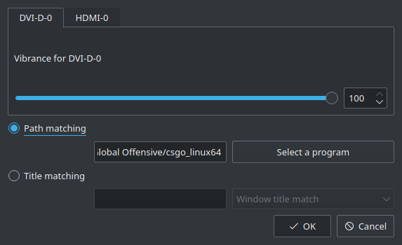

# Vibrant Linux

Main Program:



Program entry editor:



vibrantLinux is a gui tool that serves the same purpose as vibrance gui on windows, which to modify the saturation of any given screen whenever certain programs are launched/are in focus.

It currently only supports NVIDIA and GPUS that implement the Color Transformation Matrix (CTM). If you figure out how to add this support to any other GPUs please inform me so that vibrantLinux can support those GPUs.

# Requirements

```
git
qt
libXNVCtrl
libxcb
libxcb-ewmh
libX11
libXrandr
libvibrant
```

# Installation

```
git clone https://gitlab.com/zee220/vibrantlinux
cd vibrantlinux
./update.sh
```

# Updates

Head to your installation folder and run
```
./update.sh
```

